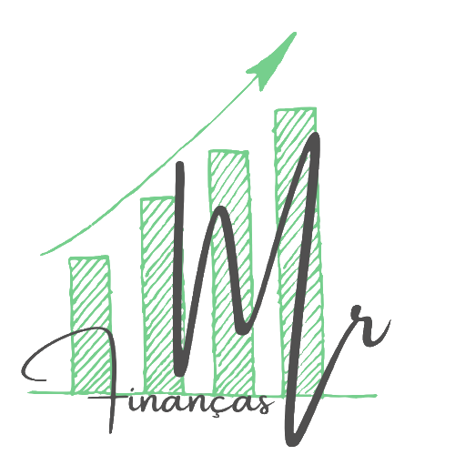
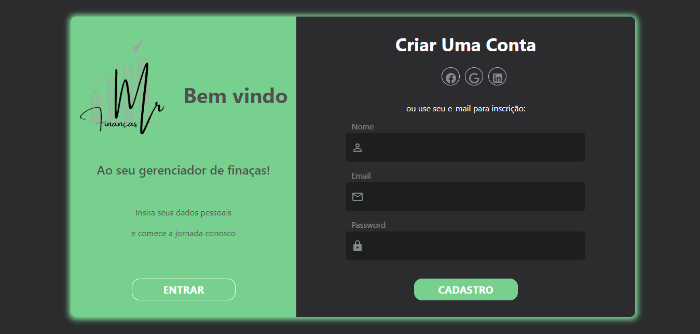
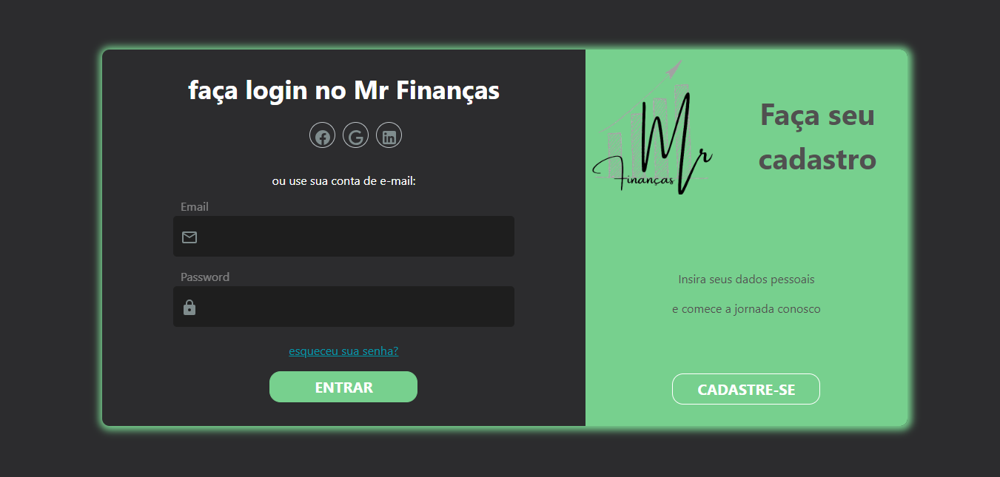
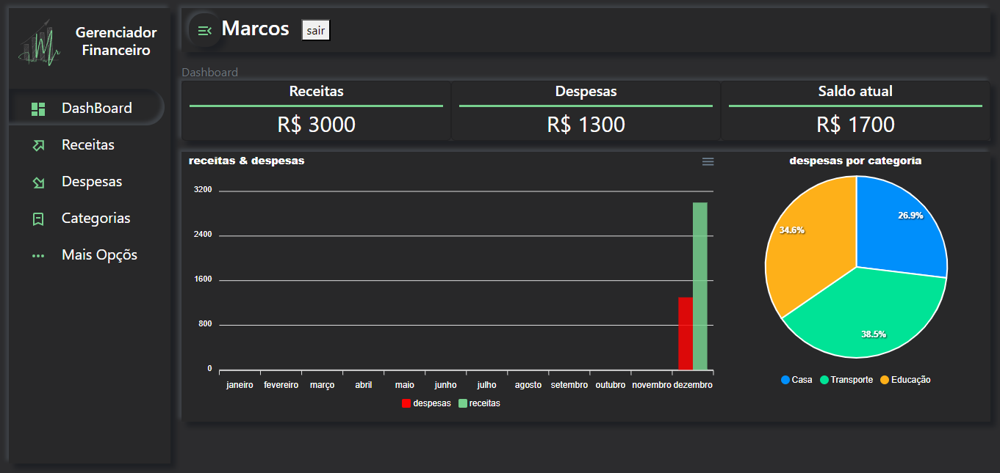
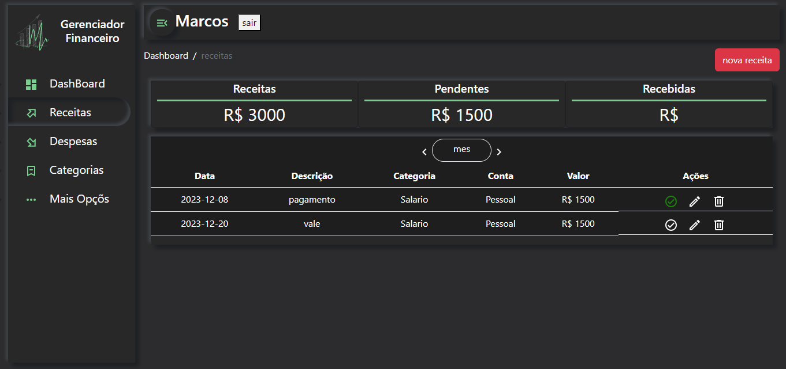
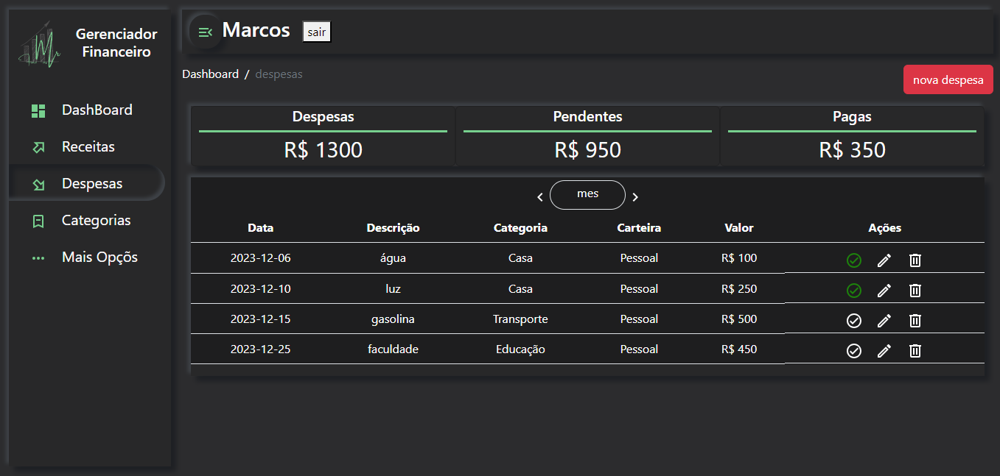
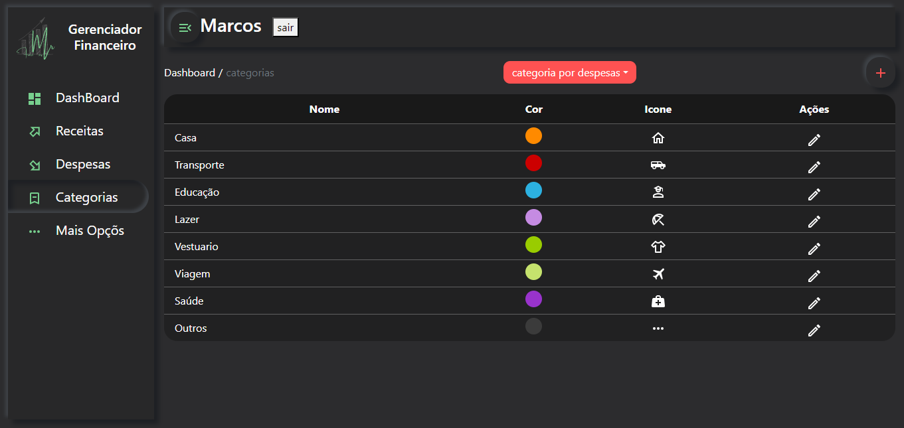

<h1 align="center">
    
</h1>

<h2>
    Sobre
</h2>
O Mr Finanças é uma aplicação desenvolvida para auxiliar na gestão eficiente e organizada das finanças individuais. Com uma interface intuitiva esta ferramenta proporciona aos usuários uma visão abrangente de suas receitas, despesas e metas financeiras.

## Índice

- <a href="#funcionalidades-do-projeto">Funcionalidades do Projeto</a>
- <a href="#layout">Layout</a>
- <a href="#como-rodar-este-projeto?">Como rodar este projeto?</a>
- <a href="#ferramentas">Ferramentas</a>
- <a href="#próximos-passos">Próximos passos</a>

## Funcionalidades do Projeto

- [x] Cadastro de usuário
- [x] Login
- [x] Cadastro de receitas e despesas
- [x] Visualização de receitas e despesas do mes corrente
- [x]

## Layout








## Como rodar este projeto?

### Será necessario ter instalado em sua máquina o docker compose

```bash
# Clone este repositório
$ git clone https://github.com/marcos-burghausen/Financas.git

# Acesse a pasta do prjeto no seu terminal
$ cd Finacas

# Inicie os containers
$ docker compose up -d

# Acesse o bash do backend
$ docker exec -it Mr_backend bash

# Instale as dependencias
$ composer install
```

### Renomeie o arquivo .env.example na pasta backend

### Substitua as linhas 11 a 16 pelo código a seguir

```bash
DB_CONNECTION=mysql
DB_HOST=mysql
DB_PORT=3306
DB_DATABASE=Mr_database
DB_USERNAME=user
DB_PASSWORD=user
```

```bash
# Gere o códgo jwt que aplicação usara para fazer a autenticação do usuario
php artisan jwt:secret
```

### Acesse a aplicação em (http://localhost:4081)

## Ferramentas

1. [Laravel 10](https://laravel.com/)
2. [Vue.js 3](https://vuejs.org/)
3. [Typescript](https://www.typescriptlang.org/)
4. [jwt-auth](https://jwt-auth.readthedocs.io/en/develop/)

## Próximos Passos

- [ ] Funcionalidade de despesas para cartão de crédito

Funcionalidades do App de Controle de Finanças Pessoais e Investimentos
Cadastro de Usuários
Métodos de Cadastro/Login: Tradicional, Facebook, Google e LinkedIn.
Perfis de Usuário: USER, TRADER, USER_TRADER, ADMIM, FULL.
Lançamentos
Tipos de Lançamentos: Despesas, receitas, despesas de cartão de crédito, estornos.
Categorias e Subcategorias: Específicas para receitas e despesas.
Vinculação: Lançamentos vinculados a contas ou cartões de crédito.
Contas e Cartões de Crédito
Cadastro de Contas: Usuário pode cadastrar contas bancárias.
Cadastro de Cartões de Crédito: Cartões vinculados a contas.
Categorias: Contas e cartões possuem categorias e subcategorias.
Ícones: Ícones personalizados com cores escolhidas pelo usuário.
Perfil do Usuário
Avatar: Inserir/alterar avatar.
Dados Pessoais: Inserir/alterar endereço, documentos, etc.
Troca de Senha: Opção para trocar senha.
Notificações: Escolher se deseja receber notificações e quando (no dia ou até 3 dias antes).
Relatórios e Gráficos
Relatórios: Mensais, trimestrais e anuais.
Gráficos: Visualização de despesas e receitas.
Alertas e Notificações
Alertas: Vencimentos de contas, limites de gastos, estornos de cartão de crédito.
Notificações: Mudanças significativas nas finanças.
Orçamento
Planejamento: Ferramentas para planejamento de orçamento mensal e anual.
Monitoramento: Monitorar cumprimento do orçamento e alertar sobre desvios.
Boas Práticas de Desenvolvimento
Segurança:
Criptografia para proteger dados sensíveis.
Autenticação multifator para login.
Usabilidade:
Interface intuitiva e fácil de usar.
Acessibilidade para pessoas com deficiência.
Escalabilidade:
Arquitetura escalável para suportar crescimento.
Otimização de desempenho para experiência fluida.
Manutenção:
Documentação detalhada do código e funcionalidades.
Testes contínuos para garantir qualidade e estabilidade.
Considerações Finais
Feedback dos Usuários: Sistema de feedback para sugestões e problemas.
Atualizações: Planejamento de atualizações regulares.

quero desenvolver um app para controle de finanças pessoal e futuramente vai ter também controle de investimentos voltado para quem atua no mercado financeiro para qualquer tipo de investimentos
o app vai ter alguns tipos de usuário (USER, TRADER, USER_TRADER, ADMIM, FULL), na primeira versão quero desenvolver apenas funcionalidades para finanças pessoal claro que sempre pensando nas implementações futuras
o app vai ter cadastro de usuários o usuário vai poder cadastrar lançamentos como despesas, receitas e despesas de cartão de credito no cartão de credito também poderão ser lançados estornos, os lançamentos terão categorias especificas para receitas e despesas, essas categorias terão subcategorias, os lançamentos estarão vinculados a uma contas ou a um cartão se for lançamento de cartão de crédito
o usuário poderá cadastrar contas e cartão de credito o qual deve estar vinculado a uma conta, também poderá cadastrar categorias e subcategorias
as contas também terão categorias
as contas, cartões, categorias e subcategorias terão ícones esses poderão ter cores escolhidas pelo usuário
o usuário terá um perfil onde ele poderá inserir/alterar seu avatar, trocar senha, selecionar se ele quer receber notificações dos vencimentos dos lançamentos se a notificação sera enviada no dia ou ate 3 dias antes do vencimento e tambem o horario que a notificação sera enviada,inserir alguns dados como endereço, documentos...
para o cadastro/login poderá ser feito da forma tradicional, facebook, goolge e LinkedIn
quero que analise minhas funcionalidades e veja se tem algo importante que eu possa ter esquecido e deva ser implementado
quero desenvolver esse app de forma profissional usando boas praticas tanto no planejamento quanto desenvolvimento
a stack de tecnologia que quero usar vue js3 no front, laravel no back docker e mysql

+------------------+ +------------------+ +------------------+
| Users | | Accounts | | CreditCards |
+------------------+ +------------------+ +------------------+
| UserID (PK) |<----->| AccountID (PK) |<----->| CardID (PK) |
| Username | | UserID (FK) | | AccountID (FK) |
| Password | | AccountName | | CardName |
| Email | | AccountType | | CardType |
| Avatar | | Balance | | Limit |
| Notifications | +------------------+ +------------------+
+------------------+ | Categories |
+------------------+
| CategoryID (PK) |
| CardID (FK) |
| CategoryName |
| Subcategories |
+------------------+

+------------------+ +------------------+ +------------------+
| Transactions | | Categories | | Subcategories |
+------------------+ +------------------+ +------------------+
| TransactionID(PK)|<----->| CategoryID (PK) |<----->| SubcategoryID(PK)|
| UserID (FK) | | AccountID (FK) | | CategoryID (FK) |
| AccountID (FK) | | CardID (FK) | | SubcategoryName |
| CardID (FK) | | CategoryName | +------------------+
| CategoryID (FK) | +------------------+
| SubcategoryID(FK)|
| Amount |
| Date |
| Type |
+------------------+

+------------------+
| Reports |
+------------------+
| ReportID (PK) |
| UserID (FK) |
| ReportType |
| ReportPeriod |
| ReportData |
+------------------+

Users: Armazena informações dos usuários, incluindo preferências de notificações.
Accounts: Contas bancárias vinculadas aos usuários.
CreditCards: Cartões de crédito vinculados às contas.
Categories: Categorias de despesas e receitas para contas e cartões.
Subcategories: Subcategorias dentro das categorias.
Transactions: Lançamentos de despesas, receitas e estornos, vinculados a contas ou cartões.
Reports: Relatórios gerados pelos usuários.
Relacionamentos
Users têm várias Accounts e CreditCards.
Accounts e CreditCards têm várias Categories.
Categories têm várias Subcategories.
Transactions são vinculadas a Users, Accounts, CreditCards, Categories e Subcategories.
Reports são gerados pelos Users.
