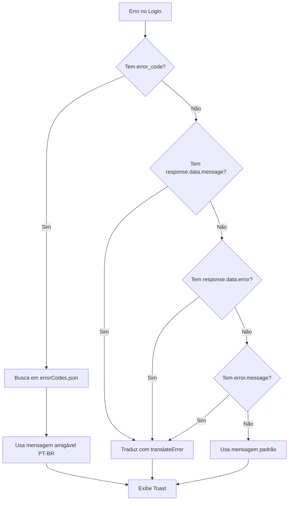

# Melhorias no LoginView - Tratamento de Erros e Diálogos

## 📋 Resumo

Implementação de tratamento de erros aprimorado com `error_code` e errorCodes.json, além de diálogos de Termos de Uso e Política de Privacidade no LoginView.

## 🎯 Melhorias Implementadas

### 1. **Tratamento de Erro com error_code**

#### Antes ❌

```typescript
// Apenas tradução manual de strings em inglês
const translatedError = translateError(errorMessage);
```

#### Depois ✅

```typescript
// Prioridade ao error_code do errorCodes.json
const errorCodes = await import("@/assets/errorCodes.json");

// Prioridade 1: error_code
if (errorData.error_code && errorCodes.default[errorData.error_code]) {
  errorMessage = errorCodes.default[errorData.error_code];
}
// Prioridade 2: response.data.message
else if (errorData.response?.data?.message) {
  errorMessage = translateError(errorData.response.data.message);
}
// Fallbacks adicionais...
```

### 2. **Diálogos de Termos e Privacidade**

#### Botões no Footer

```vue
<v-btn
  variant="text"
  size="x-small"
  color="primary"
  @click="dialogTermos = true"
>
  Termos de Uso
</v-btn>

<v-btn
  variant="text"
  size="x-small"
  color="primary"
  @click="dialogPrivacidade = true"
>
  Política de Privacidade
</v-btn>
```

#### Variáveis Reativas

```typescript
const dialogTermos = ref(false);
const dialogPrivacidade = ref(false);
```

## 🔄 Fluxo de Tratamento de Erros



## 📝 Estrutura de Prioridades

### Hierarquia de Tratamento de Erros

1. **error_code (LGPD/Profissional)**

   - Fonte: `errorCodes.json`
   - Exemplo: `{error_code: "SP002"}`
   - Mensagem: "Ocorreu um erro ao criar o usuário e a conta."

2. **response.data.message (Backend)**

   - Fonte: Resposta da API Laravel
   - Exemplo: "The provided credentials are incorrect"
   - Ação: Traduz com `translateError()`

3. **response.data.error (Backend alternativo)**

   - Fonte: Resposta alternativa da API
   - Ação: Traduz com `translateError()`

4. **error.message (JavaScript/Network)**

   - Fonte: Erros de rede ou JavaScript
   - Exemplo: "Network error"
   - Ação: Traduz com `translateError()`

5. **Mensagem Padrão (Fallback final)**
   - "Erro ao fazer login. Verifique suas credenciais e tente novamente."

## 🎨 Componentes dos Diálogos

### Dialog Termos de Uso

- **Ícone**: `mdi-file-document`
- **Cabeçalho**: Background primary
- **Conteúdo**: 10 seções scrollable
- **Botão Fechar**: X no canto + botão "Entendi"

### Dialog Política de Privacidade

- **Ícone**: `mdi-shield-lock`
- **Cabeçalho**: Background primary
- **Conteúdo**: 12 seções scrollable (incluindo LGPD)
- **Botão Fechar**: X no canto + botão "Entendi"

## 📊 Comparação com CadastroView

| Aspecto                   | LoginView | CadastroView |
| ------------------------- | --------- | ------------ |
| **Tratamento error_code** | ✅ Sim    | ✅ Sim       |
| **errorCodes.json**       | ✅ Sim    | ✅ Sim       |
| **Diálogo Termos**        | ✅ Sim    | ✅ Sim       |
| **Diálogo Privacidade**   | ✅ Sim    | ✅ Sim       |
| **Tradução de erros**     | ✅ Sim    | ✅ Sim       |
| **Toast notifications**   | ✅ Sim    | ✅ Sim       |

## 🔐 Códigos de Erro Comuns

### Login Específicos (estimados)

```json
{
  "L001": "Credenciais inválidas",
  "L002": "Conta bloqueada",
  "L003": "Muitas tentativas de login",
  "L004": "Email não verificado",
  "L005": "Sessão expirada"
}
```

### Tradução Manual (translateError)

```typescript
{
  'The provided credentials are incorrect': 'Email ou senha incorretos',
  'These credentials do not match our records': 'Email ou senha incorretos',
  'User not found': 'Usuário não encontrado',
  'Invalid credentials': 'Credenciais inválidas',
  'Network error': 'Erro de conexão com o servidor',
  'Timeout': 'A requisição demorou muito tempo'
}
```

## 🧪 Cenários de Teste

### 1. Erro com error_code

```
Backend retorna: {error_code: "L001"}
Resultado: "Credenciais inválidas" (de errorCodes.json)
Toast: vermelho, ícone mdi-alert-circle
```

### 2. Erro sem error_code

```
Backend retorna: {message: "Invalid credentials"}
Resultado: "Credenciais inválidas" (de translateError)
Toast: vermelho, ícone mdi-alert-circle
```

### 3. Erro de rede

```
Network error
Resultado: "Erro de conexão com o servidor"
Toast: vermelho, ícone mdi-alert-circle
```

### 4. Teste dos Diálogos

```
1. Clica "Termos de Uso" → Dialog abre ✓
2. Scroll funciona ✓
3. Fecha com X ou "Entendi" ✓
4. Clica "Política de Privacidade" → Dialog abre ✓
5. Conteúdo completo visível ✓
```

## 💡 Melhorias em Relação ao Código Anterior

### Antes

```typescript
// Apenas tradução manual
let errorMessage = "Erro ao fazer login";

if (error.response?.data?.message) {
  errorMessage = error.response.data.message;
} else if (error.response?.data?.error) {
  errorMessage = error.response.data.error;
} else if (error.message) {
  errorMessage = error.message;
}

const translatedError = translateError(errorMessage);
```

### Depois

```typescript
// Prioridade a error_code, depois tradução
const errorCodes = await import("@/assets/errorCodes.json");
let errorMessage = "Erro ao fazer login. Verifique suas credenciais...";

// PRIORIDADE 1: error_code (profissional)
if (errorData.error_code && errorCodes.default[errorData.error_code]) {
  errorMessage = errorCodes.default[errorData.error_code];
}
// PRIORIDADE 2-4: Fallbacks com tradução
else if (errorData.response?.data?.message) {
  errorMessage = translateError(errorData.response.data.message);
}
// ... mais fallbacks
```

## 📁 Arquivos Modificados

```
frontend/src/views/acesso/LoginView.vue
├── Template
│   ├── Footer com botões clicáveis
│   ├── Dialog Termos de Uso (completo)
│   └── Dialog Política de Privacidade (completo)
├── Script
│   ├── dialogTermos ref
│   ├── dialogPrivacidade ref
│   └── handleLogin com error_code
└── Style
    └── .terms-content (estilos)
```

## 🎯 Benefícios

### Para o Usuário

- ✅ Mensagens de erro claras em português
- ✅ Acesso fácil aos termos e políticas
- ✅ Feedback imediato sobre problemas
- ✅ Transparência sobre uso de dados

### Para o Sistema

- ✅ Tratamento de erros padronizado
- ✅ Conformidade com LGPD
- ✅ Logs detalhados (console.error)
- ✅ Manutenção facilitada (errorCodes.json centralizado)

### Para Desenvolvimento

- ✅ Código reutilizável (mesmo padrão do CadastroView)
- ✅ Fácil adicionar novos códigos de erro
- ✅ Tradução separada da lógica
- ✅ Consistência entre telas

## 🔍 Detalhes Técnicos

### Import Dinâmico

```typescript
const errorCodes = await import("@/assets/errorCodes.json");
```

- Carrega errorCodes.json sob demanda
- Não aumenta bundle inicial
- TypeScript: usa `default` para acessar

### Type Safety

```typescript
errorCodes.default[errorData.error_code as keyof typeof errorCodes.default];
```

- Cast para garantir type-safety
- Evita erros em tempo de compilação
- IntelliSense funcional

### Timeout Aumentado

```typescript
timeout: 5000; // Antes: 4000
```

- Mais tempo para ler mensagens de erro
- Alinhado com CadastroView

## 📞 Contatos nos Diálogos

⚠️ **Importante**: Substituir antes de produção!

```
Email: suporte@financas.com
Email: privacidade@financas.com
DPO: dpo@financas.com
Telefone: (00) 0000-0000
Endereço: Rua Exemplo, 123 - Cidade/UF
```

## ✅ Checklist de Implementação

- [x] Variáveis de diálogo declaradas
- [x] Botões com @click nos diálogos
- [x] Dialog Termos implementado
- [x] Dialog Privacidade implementado
- [x] Tratamento error_code adicionado
- [x] Import errorCodes.json
- [x] Prioridades de erro definidas
- [x] Estilos .terms-content
- [x] Timeout dos toasts ajustado
- [x] Console.error mantido

## 🚀 Próximos Passos

### Backend (se necessário)

1. Adicionar error_code às respostas de erro do login
2. Mapear códigos específicos (L001, L002, etc.)
3. Atualizar errorCodes.json com novos códigos

### Frontend

1. Testar em diferentes cenários de erro
2. Validar mensagens em português
3. Verificar responsividade dos diálogos

### Produção

1. **Substituir emails/telefones placeholders**
2. Revisar conteúdo dos termos e políticas
3. Adicionar versão e data reais
4. Configurar analytics para erros

---

**Versão**: 1.0.0  
**Data**: Janeiro 2025  
**Status**: ✅ Implementado  
**Conformidade**: LGPD Ready
