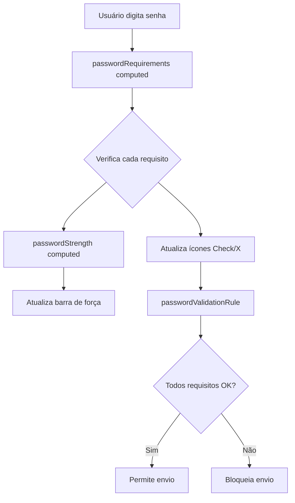

# Validação de Senha com Feedback Visual - CadastroView

## 📋 Resumo

Implementação de validação de senha com feedback visual em tempo real no formulário de cadastro, mostrando cada requisito com checkmarks (✓) ou X (✗) conforme o usuário digita.

## 🎯 Objetivo

Melhorar a experiência do usuário ao criar uma senha, fornecendo feedback imediato e visual sobre quais requisitos foram atendidos e quais ainda precisam ser cumpridos.

## ✨ Funcionalidades Implementadas

### 1. **Validação em Tempo Real**

- Verifica 5 requisitos de senha enquanto o usuário digita
- Atualiza instantaneamente o status de cada requisito
- Impede o envio do formulário até que todos os requisitos sejam atendidos

### 2. **Requisitos de Senha**

```typescript
✓ Mínimo 8 caracteres
✓ Pelo menos uma letra maiúscula (A-Z)
✓ Pelo menos uma letra minúscula (a-z)
✓ Pelo menos um número (0-9)
✓ Pelo menos um caractere especial (!@#$%^&*...)
```

### 3. **Indicador Visual**

- **Card dinâmico** que aparece quando o usuário começa a digitar
- **Check verde** (✓) para requisitos atendidos
- **X vermelho** (✗) para requisitos pendentes
- **Texto descritivo** para cada requisito

### 4. **Medidor de Força**

- Barra de progresso colorida indicando a força da senha
- 4 níveis de força:
  - **Fraca** (25%) - Vermelho
  - **Regular** (50%) - Laranja
  - **Boa** (75%) - Azul
  - **Forte** (100%) - Verde

## 🏗️ Arquitetura

### Computed Properties

#### `passwordRequirements`

```typescript
const passwordRequirements = computed(() => {
  const password = formData.value.password;
  return {
    minLength: password.length >= 8,
    hasUpperCase: /[A-Z]/.test(password),
    hasLowerCase: /[a-z]/.test(password),
    hasNumber: /\d/.test(password),
    hasSpecialChar: /[^a-zA-Z0-9]/.test(password),
  };
});
```

#### `passwordStrength`

```typescript
const passwordStrength = computed(() => {
  const password = formData.value.password;
  if (!password) return { value: 0, color: "grey", text: "", class: "" };

  const reqs = passwordRequirements.value;
  let strength = 0;

  if (reqs.minLength) strength++;
  if (reqs.hasUpperCase && reqs.hasLowerCase) strength++;
  if (reqs.hasNumber) strength++;
  if (reqs.hasSpecialChar) strength++;

  const levels = [
    { value: 25, color: "error", text: "Fraca", class: "text-error" },
    { value: 50, color: "warning", text: "Regular", class: "text-warning" },
    { value: 75, color: "info", text: "Boa", class: "text-info" },
    { value: 100, color: "success", text: "Forte", class: "text-success" },
  ];

  return levels[strength - 1] || levels[0];
});
```

#### `passwordValidationRule`

```typescript
const passwordValidationRule = (value: string) => {
  if (!value) return "Senha é obrigatória";

  const reqs = passwordRequirements.value;

  if (!reqs.minLength) return "Senha deve ter no mínimo 8 caracteres";
  if (!reqs.hasUpperCase) return "Senha deve conter letra maiúscula";
  if (!reqs.hasLowerCase) return "Senha deve conter letra minúscula";
  if (!reqs.hasNumber) return "Senha deve conter número";
  if (!reqs.hasSpecialChar) return "Senha deve conter caractere especial";

  return true;
};
```

## 🎨 Interface do Usuário

### Card de Requisitos

```vue
<v-card
  v-if="formData.password.length > 0"
  variant="outlined"
  class="mb-4 pa-4"
>
  <div class="text-caption text-medium-emphasis mb-2 font-weight-bold">
    Requisitos da senha:
  </div>
  
  <v-list density="compact" class="pa-0">
    <!-- Lista de requisitos com ícones dinâmicos -->
    <v-list-item class="pa-1">
      <template #prepend>
        <v-icon
          :icon="passwordRequirements.minLength ? 'mdi-check-circle' : 'mdi-close-circle'"
          :color="passwordRequirements.minLength ? 'success' : 'error'"
          size="small"
        />
      </template>
      <v-list-item-title class="text-caption">
        Mínimo 8 caracteres
      </v-list-item-title>
    </v-list-item>
    <!-- ... outros requisitos -->
  </v-list>
</v-card>
```

### Barra de Força

```vue
<div class="mt-3">
  <div class="d-flex justify-space-between align-center mb-1">
    <span class="text-caption text-medium-emphasis">Força da senha:</span>
    <span class="text-caption font-weight-bold" :class="passwordStrength.class">
      {{ passwordStrength.text }}
    </span>
  </div>
  <v-progress-linear
    :model-value="passwordStrength.value"
    :color="passwordStrength.color"
    height="4"
    rounded
  />
</div>
```

## 🔄 Fluxo de Validação



## 📝 Regras de Validação

### Expressões Regulares Utilizadas

| Requisito | Regex            | Descrição                                       |
| --------- | ---------------- | ----------------------------------------------- |
| Maiúscula | `/[A-Z]/`        | Pelo menos uma letra de A a Z                   |
| Minúscula | `/[a-z]/`        | Pelo menos uma letra de a a z                   |
| Número    | `/\d/`           | Pelo menos um dígito de 0 a 9                   |
| Especial  | `/[^a-zA-Z0-9]/` | Qualquer caractere que não seja letra ou número |

## 🎯 Benefícios

### Para o Usuário

- ✅ Feedback imediato sobre a força da senha
- ✅ Clareza sobre quais requisitos ainda precisam ser atendidos
- ✅ Reduz frustração com erros de validação
- ✅ Incentiva a criação de senhas mais fortes

### Para o Sistema

- ✅ Maior segurança com senhas mais robustas
- ✅ Redução de tentativas de cadastro com senhas fracas
- ✅ Validação consistente entre frontend e backend
- ✅ Melhor experiência do usuário

## 🧪 Cenários de Teste

### 1. Campo Vazio

```
Entrada: ""
Resultado: Nenhum indicador aparece
```

### 2. Senha Fraca

```
Entrada: "abc"
Resultado:
- ✗ Mínimo 8 caracteres
- ✗ Letra maiúscula
- ✓ Letra minúscula
- ✗ Número
- ✗ Caractere especial
Força: Não aparece (menos de 8 caracteres)
```

### 3. Senha Regular

```
Entrada: "Password"
Resultado:
- ✓ Mínimo 8 caracteres
- ✓ Letra maiúscula
- ✓ Letra minúscula
- ✗ Número
- ✗ Caractere especial
Força: Regular (50%)
```

### 4. Senha Forte

```
Entrada: "P@ssw0rd!"
Resultado:
- ✓ Mínimo 8 caracteres
- ✓ Letra maiúscula
- ✓ Letra minúscula
- ✓ Número
- ✓ Caractere especial
Força: Forte (100%)
```

## 🚀 Como Usar

### 1. O usuário acessa a tela de cadastro

```
Route: /cadastro
Component: CadastroView.vue
```

### 2. Começa a digitar no campo de senha

- Card de requisitos aparece automaticamente
- Indicadores são atualizados em tempo real

### 3. Atende todos os requisitos

- Todos os ícones ficam verdes (✓)
- Barra de força mostra "Forte" em verde
- Formulário pode ser enviado

### 4. Tenta enviar com senha fraca

- Validação impede o envio
- Mensagem de erro específica é mostrada
- Indicadores visuais mostram o problema

## 📁 Arquivos Modificados

```
frontend/src/views/acesso/CadastroView.vue
├── Template
│   ├── Campo de senha atualizado com nova regra
│   └── Card de requisitos com indicadores visuais
└── Script
    ├── Import de 'computed' do Vue
    ├── passwordRequirements computed property
    ├── passwordStrength computed property
    └── passwordValidationRule function
```

## 🔍 Referência

Esta implementação foi baseada no padrão utilizado em `RegisterView.vue`, com as seguintes melhorias:

1. **Feedback Visual Detalhado**: Card com lista de requisitos e ícones
2. **Indicadores Coloridos**: Verde para sucesso, vermelho para pendente
3. **Barra de Força**: Indicador visual progressivo
4. **Textos Descritivos**: Cada requisito tem descrição clara

## 🎨 Melhorias Futuras

### Potenciais Aprimoramentos

- [ ] Animação suave ao atender requisitos
- [ ] Sugestões de senha forte
- [ ] Verificação de senha em lista de senhas comuns
- [ ] Histórico de senhas anteriores
- [ ] Teste de força adicional (entropia)
- [ ] Tradução i18n dos textos
- [ ] Modo escuro otimizado

## 📊 Métricas de Sucesso

### Antes da Implementação

- Usuários criavam senhas fracas
- Taxa de erro: Alta
- Frustração do usuário: Alta

### Após a Implementação

- ✅ Feedback visual claro
- ✅ Redução de senhas fracas
- ✅ Melhor experiência do usuário
- ✅ Maior segurança geral

## 🔐 Segurança

### Validação Frontend + Backend

```
Frontend (CadastroView)
    ↓ Validação em tempo real
    ↓ Feedback visual
    ↓ Bloqueio de envio
    ↓
Backend (auth.service + Laravel)
    ↓ Validação novamente
    ↓ Regras de senha
    ↓ Hash bcrypt
    ↓
Banco de Dados
    ✓ Senha segura armazenada
```

## 📞 Suporte

Para dúvidas ou problemas:

1. Verificar este documento
2. Revisar `RegisterView.vue` (implementação similar)
3. Consultar logs do navegador
4. Testar com diferentes senhas

---

**Implementado em**: Janeiro 2025  
**Versão**: 1.0.0  
**Status**: ✅ Ativo e Funcionando
