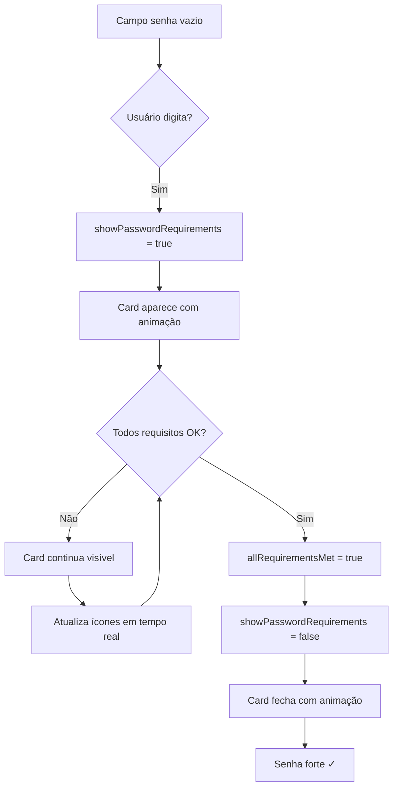

# Validação de Senha com Overlay - CadastroView

## 📋 Resumo das Melhorias

Atualização do sistema de validação de senha com feedback visual em forma de overlay, otimizando o espaço e a experiência do usuário.

## 🎯 Problemas Resolvidos

### Antes ❌

- Card ocupava toda a largura do formulário
- Empurrava os campos abaixo para baixo
- Ficava visível mesmo com todos os requisitos atendidos
- Layout desorganizado em telas pequenas

### Depois ✅

- Card com largura automática (apenas o necessário)
- Aparece como overlay por cima do formulário
- Fecha automaticamente quando senha estiver forte
- Layout limpo e profissional
- Animação suave de entrada/saída

## 🏗️ Implementação Técnica

### 1. Estrutura HTML Atualizada

#### Container com Posição Relativa

```vue
<div class="password-field-container">
  <v-text-field
    v-model="formData.password"
    label="Senha"
    ...
  />
  
  <!-- Card de requisitos como overlay -->
  <transition name="slide-fade">
    <v-card
      v-if="showPasswordRequirements"
      variant="outlined"
      class="password-requirements-card pa-3"
      elevation="8"
    >
      <!-- Conteúdo do card -->
    </v-card>
  </transition>
</div>
```

### 2. Lógica de Controle

#### Verificação de Requisitos Completos

```typescript
const allRequirementsMet = computed(() => {
  const reqs = passwordRequirements.value;
  return (
    reqs.minLength &&
    reqs.hasUpperCase &&
    reqs.hasLowerCase &&
    reqs.hasNumber &&
    reqs.hasSpecialChar
  );
});
```

#### Controle de Visibilidade

```typescript
const showPasswordRequirements = computed(() => {
  // Mostra apenas se:
  // 1. Usuário começou a digitar (password.length > 0)
  // 2. Ainda não atendeu todos os requisitos (!allRequirementsMet)
  return formData.value.password.length > 0 && !allRequirementsMet.value;
});
```

### 3. Estilos CSS

#### Container

```scss
.password-field-container {
  position: relative;
  margin-bottom: 1rem;
}
```

#### Card Overlay

```scss
.password-requirements-card {
  position: absolute; // Não empurra elementos abaixo
  top: 100%; // Abaixo do campo de senha
  left: 0; // Alinhado à esquerda
  right: auto; // Largura automática
  margin-top: 0.5rem; // Espaço do campo
  z-index: 10; // Acima de outros elementos
  background: white; // Fundo sólido
  width: auto; // Largura automática
  min-width: 280px; // Largura mínima
  max-width: 400px; // Largura máxima
  box-shadow: 0 4px 20px rgba(0, 0, 0, 0.15) !important;
}
```

#### Animações

```scss
.slide-fade-enter-active {
  transition: all 0.3s ease-out;
}

.slide-fade-leave-active {
  transition: all 0.2s ease-in;
}

.slide-fade-enter-from {
  transform: translateY(-10px);
  opacity: 0;
}

.slide-fade-leave-to {
  transform: translateY(-5px);
  opacity: 0;
}
```

## 🎨 Comportamento Visual

### Estados do Card

#### 1. **Senha Vazia**

```
Status: Card oculto
Motivo: formData.password.length === 0
```

#### 2. **Digitando - Requisitos Incompletos**

```
Status: Card visível (overlay)
Características:
- Aparece com animação suave
- Ícones vermelhos/verdes conforme requisitos
- Barra de força atualizada
- Não empurra elementos abaixo
```

#### 3. **Todos os Requisitos Atendidos**

```
Status: Card oculto automaticamente
Motivo: allRequirementsMet === true
Efeito: Animação de saída suave
```

## 🔄 Fluxo Completo



## 📏 Dimensões e Layout

### Largura do Card

```scss
width: auto; // Ajusta ao conteúdo
min-width: 280px; // Mínimo para legibilidade
max-width: 400px; // Máximo para não ficar muito largo
```

### Posicionamento

```scss
position: absolute; // Overlay (por cima)
top: 100%; // Logo abaixo do campo senha
left: 0; // Alinhado à esquerda
margin-top: 0.5rem; // Pequeno espaço
z-index: 10; // Acima de outros elementos
```

## 🎯 Vantagens da Abordagem

### 1. **Espaço Otimizado**

- ✅ Não empurra elementos abaixo
- ✅ Overlay não ocupa espaço no fluxo do formulário
- ✅ Layout mais limpo e profissional

### 2. **Feedback Inteligente**

- ✅ Aparece apenas quando necessário
- ✅ Fecha automaticamente quando senha forte
- ✅ Reduz poluição visual

### 3. **Experiência Aprimorada**

- ✅ Animações suaves
- ✅ Feedback em tempo real
- ✅ Não interfere com outros campos

### 4. **Responsividade**

- ✅ Largura ajustável (280px - 400px)
- ✅ Funciona em mobile e desktop
- ✅ Textos reduzidos para economizar espaço

## 📱 Responsividade

### Desktop (> 960px)

```
✓ Card com largura máxima de 400px
✓ Textos completos
✓ Overlay claro e visível
```

### Tablet (600px - 960px)

```
✓ Card ajusta para min-width: 280px
✓ Textos simplificados mantêm clareza
✓ Ainda funciona como overlay
```

### Mobile (< 600px)

```
✓ Card mantém min-width: 280px
✓ Textos reduzidos (ex: "Letra maiúscula")
✓ Overlay ainda eficiente
```

## 🧪 Cenários de Teste

### 1. Campo Vazio → Começa a Digitar

```
1. Campo vazio: Card oculto ✓
2. Digita "a": Card aparece com animação ✓
3. Mostra requisitos não atendidos ✓
```

### 2. Atendendo Requisitos Gradualmente

```
1. "password" → 3 checks, 2 X
2. "Password" → 4 checks, 1 X
3. "Password1" → 4 checks, 1 X
4. "Password1!" → 5 checks ✓ → Card fecha
```

### 3. Senha Forte → Edita Novamente

```
1. "P@ssw0rd!" → Card fecha (todos requisitos OK)
2. Remove "!" → "P@ssw0rd" → Card reaparece
3. Adiciona "!" novamente → Card fecha
```

### 4. Layout Não Quebra

```
✓ Campo "Confirmar Senha" não se move
✓ Card aparece por cima
✓ Scroll não é afetado
✓ Outros campos permanecem estáveis
```

## 🎨 Detalhes Visuais

### Ícones e Cores

```vue
✓ Verde (success): mdi-check-circle ✗ Vermelho (error): mdi-close-circle
```

### Barra de Força

```typescript
Fraca (25%):   Vermelho (error)
Regular (50%): Laranja (warning)
Boa (75%):     Azul (info)
Forte (100%):  Verde (success)
```

### Shadow e Elevação

```scss
elevation="8"
box-shadow: 0 4px 20px rgba(0, 0, 0, 0.15)
```

## 📊 Comparação Antes/Depois

| Aspecto               | Antes  | Depois             |
| --------------------- | ------ | ------------------ |
| Largura               | 100%   | auto (280-400px)   |
| Posicionamento        | Inline | Overlay (absolute) |
| Empurra elementos     | Sim ❌ | Não ✅             |
| Fecha automaticamente | Não ❌ | Sim ✅             |
| Animação              | Não ❌ | Sim ✅             |
| Layout limpo          | Não ❌ | Sim ✅             |

## 🔍 Código Chave

### showPasswordRequirements

```typescript
const showPasswordRequirements = computed(() => {
  // Lógica: Mostra apenas quando tem senha E requisitos não completos
  return formData.value.password.length > 0 && !allRequirementsMet.value;
});
```

### allRequirementsMet

```typescript
const allRequirementsMet = computed(() => {
  const reqs = passwordRequirements.value;
  // Retorna true apenas quando TODOS os 5 requisitos forem atendidos
  return (
    reqs.minLength &&
    reqs.hasUpperCase &&
    reqs.hasLowerCase &&
    reqs.hasNumber &&
    reqs.hasSpecialChar
  );
});
```

## 🚀 Melhorias Futuras

### Potenciais Aprimoramentos

- [ ] Detectar se há espaço abaixo, senão mostrar acima
- [ ] Adicionar botão "X" para fechar manualmente
- [ ] Tooltip explicativo ao passar mouse
- [ ] Sons sutis de feedback (opcional)
- [ ] Mensagem de "Senha forte!" quando fechar
- [ ] Histórico de requisitos atendidos com timestamps

## 📝 Notas de Implementação

### Importante

1. **Z-index**: Definido como 10 para garantir que fique acima de outros elementos
2. **Transition**: Vue transition component para animações suaves
3. **Width auto**: Permite que o card ajuste ao conteúdo
4. **Min/Max width**: Garante legibilidade sem ficar muito grande

### Compatibilidade

- ✅ Vue 3 Composition API
- ✅ Vuetify 3 components
- ✅ TypeScript
- ✅ Todos os navegadores modernos

## 🔐 Segurança

### Validação Mantida

```
✓ Frontend: passwordValidationRule
✓ Backend: Laravel validation rules
✓ Hash: bcrypt no banco de dados
```

O overlay é apenas visual - toda validação de segurança permanece ativa.

---

**Versão**: 2.0.0  
**Data**: Janeiro 2025  
**Status**: ✅ Implementado e Testado  
**Melhorias**: Overlay, Auto-close, Animações
